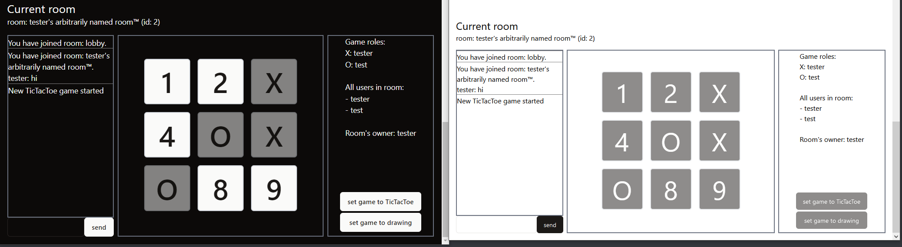
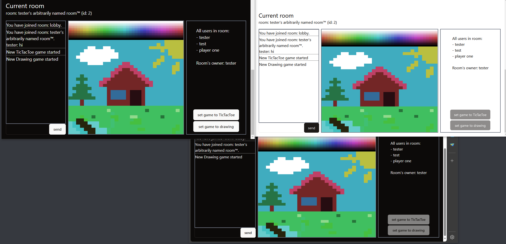
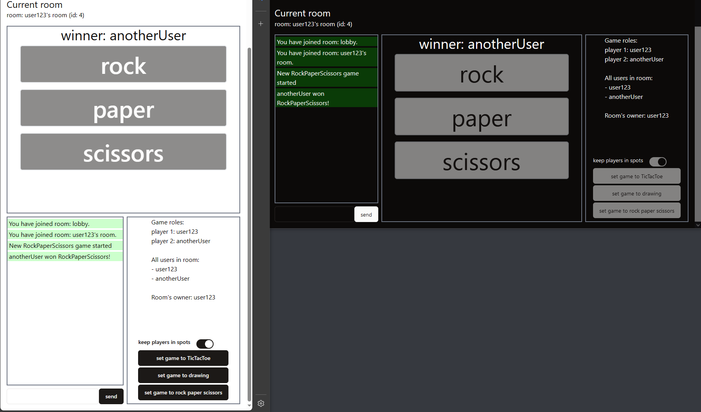

# websocket-games

Project with some multiplayer games playable in real-time over websockets

### Used technologies

[](https://www.typescriptlang.org "Typescript")
[<picture><source media="(prefers-color-scheme: light)" srcset="https://api.iconify.design/simple-icons:express.svg?color=%23000000" /></picture>](https://expressjs.com "Express.js")
[](https://vuejs.org "Vue.js")
[](https://en.wikipedia.org/wiki/JavaScript "Javascript")
[](https://en.wikipedia.org/wiki/CSS "CSS")
[](https://en.wikipedia.org/wiki/HTML "HTML")
[](https://pinia.vuejs.org "Pinia")
[](https://www.shadcn-vue.com "shadcn-vue")
[](https://tailwindcss.com "TailwindCSS")
[](https://vitejs.dev/ "Vite")
[](https://vueuse.org "VueUse")
[](https://nodejs.org/en "NodeJS")
[](https://www.sqlite.org/index.html "SQlite")
[](https://www.prisma.io/ "Prisma ORM")

## TicTacToe



##  Drawing



##  Rock, paper, scissors



### Run frontend with hot reloading

```
cd frontend
npm run dev
```

### Run backend with hot reloading

```
cd backend
npm run dev
```

### Reset db and apply migrations

```
cd backend
npx prisma migrate reset
```

### Display DB state in browser

```
cd backend
npx prisma studio
```
